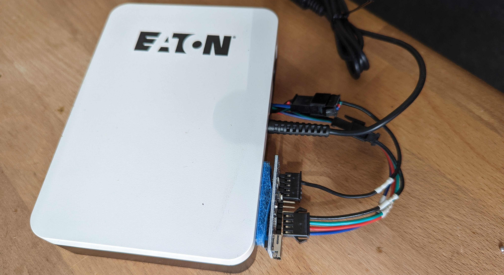
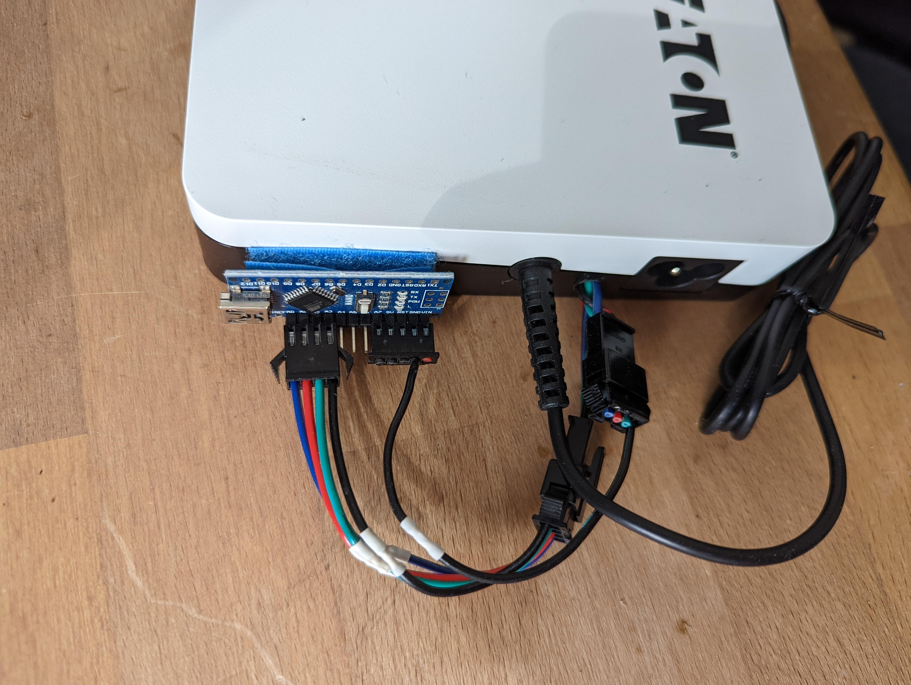

# EATON_MINI_UPS_SMARTIFIER
Eaton 3S Mini UPS Made Smart 

This repository contains code for my *Eaton 3S Mini UPS Made Smart* project. Check it out: 
https://www.instructables.com/Eaton-3S-Mini-UPS-Made-Smart/


The Eaton 3S Mini UPS is a nice little device to bridge power outages for small devices like router, rasberries, nucs and NAS. There is just one snag: It is dumb. Device state and battery levels are indicated via LEDs only and there is no way to let your home server know that power will be gone in a few minutes and it should power down gracefully.

Well, that was true until now. I smartified my device by tapping into the LEDs and you can too. With this mod the device reports its state via usb every 5 seconds which looks like this:

```
{"state":"normal","value":19}
```
Device is happily running on mains power serving 19V.

When we cut power output looks like this:

```
{"state":"discharging","value":3}
```
Device is discharging and there is only 3% power left.
## Supplies

### Stuff you need
- 1 Eaton 3S Mini UPS, no shit sherlock
- Thin colored wires, the thinner the easier. the more colors the less errors.
- Some plugs: 4 pins at least, 7 at most
- Some programmable device which offers at least 4 0-2V voltage sensing inputs. I used an Arduino nano which I randomly found in a drawer and will provide its sketch but you can use any controller you like, code is simple and easy to modify.
- A mini-USB cable if you go the Arduino Nano way
- A security screwdriver tip to open the UPS. Its called TT9 in my screwdriver set and is basically a torx with a hole in the center.
soldering iron, solder, heatshrink, scissors, drill, hotglue gun, duct tape, etc
- Mutimeter for measuring conductivity
### Skills you need
- You will need to solder onto some very small pads. A magnifying glass and a steady hand will come in handy. Maybe not the best fit for your first soldering project but not impossible as well.
- You will need to drill a hole into the case so drilling skills are beneficial :)
- You will need to modify code unless you use an Arduino nano and the same analog inputs as I do
- You will need some general computer literacy to make use of the UPS status data
## Step 1: Open Case, Drill a Hole

## Step 2: Solder Wires to the PCB

## Step 3: Add Wiring

## Step 4: Configure Microcontroller
## Step 5: Client Side UPS Status Reading
